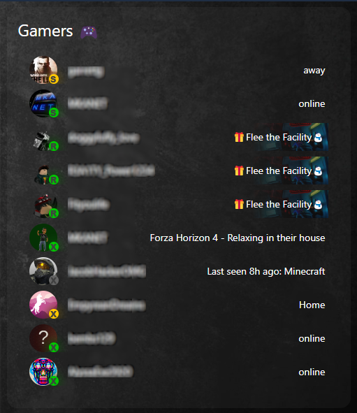

<div>
  <h3 style="font-size: 2em; font-weight: bold;">Gamer status card for <a href="https://www.home-assistant.io/integrations/steam_online/" style="text-decoration: none;">Steam</a>, <a href="https://github.com/jdeath/Roblox-Homeassistant/" style="text-decoration: none;">Roblox</a> and <a href="https://www.home-assistant.io/integrations/xbox/" style="text-decoration: none;">Xbox </a> integrations!</h3>
</div>
<br>


## Usage Example 1

```yaml
type: entities
entities:
  - type: custom:kb-steam-card
    entities:
      - sensor.steam_<steam-id>
title: Steam 🎮
```

<br>
<br>


## Usage Example 2
Note: When adding xbox entities, use the xbox sensors that end with `_status` in the sensor name.
- To show game header image as background, add `game_background: true`:<br>
- To show only users that are online, add `online_only: true`:<br>
- To show gaming network overlays, such a `S`, `R`, and `X`  for <b><i>Steam, Roblox, Xbox</i></b> network entities, add `gaming_network_overlay: true`&nbsp;&nbsp;<i>(default = false)</i>:

```yaml
type: entities
entities:
  - type: custom:kb-steam-card
    game_background: true
    online_only: true
    gaming_network_overlay: true
    entities:
      - sensor.steam_<steam-id>
      - sensor.steam_<steam-id>
      - sensor.steam_<steam-id>
      - sensor.steam_<steam-id>
      - sensor.roblox_<roblox-id>
      - sensor.roblox_<roblox-id>
      - sensor.roblox_<roblox-id>
      - sensor.<xbox-gamertag>_status
      - sensor.<xbox-gamertag>_status
      - sensor.<xbox-gamertag>_status
      - sensor.<xbox-gamertag>_status
      - sensor.<xbox-gamertag>_status
title: Gamers 🎮
```

<br>
<br>

## More Screenshots


### away \ offline state


### online state


### while playing a game


## Installation

### Prerequisites
You need to install at least one of the following gaming network integrations: <a href="https://www.home-assistant.io/integrations/steam_online/" style="text-decoration: none;">Steam</a>, <a href="https://github.com/jdeath/Roblox-Homeassistant/" style="text-decoration: none;">Roblox</a>, <a href="https://www.home-assistant.io/integrations/xbox/" style="text-decoration: none;">Xbox </a> to use with this card.

### HACS (recommended)

1. Go to the Community Store.
2. Search for `steam card plus`.
3. Press `Install`.

### Manual Installation

```yaml
resources:
  url: '<url-to-card.js>'
  type: module
```
